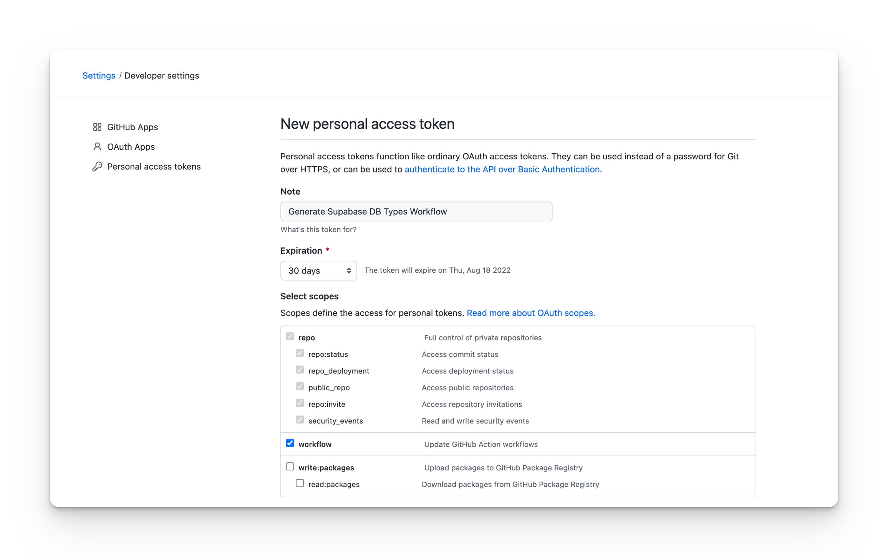
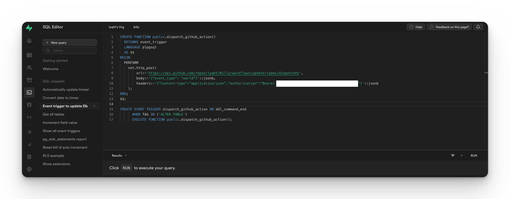

# GitHub action to generate Supabase Database types

This GitHub action workflow aims to help you to create Supabase database definition types based on the Swagger OpenAPI specification of your Supabase REST data endpoint.

> 🔖 Here's an [article](https://blog.esteetey.dev/how-to-create-and-test-a-github-action-that-generates-types-from-supabase-database#heading-how-to-create-the-github-workflow) that explains more in-depth the rationale & implementation of this GitHub action.
## What it does

This workflow is a composite action:

- To generate database types based on the Swagger OpenAPI specification of your Supabase project REST data endpoint, [openapi-typescript](https://github.com/drwpow/openapi-typescript) is used.
- Commit and push github actions to your repo are performed by the [git-auto-commit action](https://github.com/stefanzweifel/git-auto-commit-action).

Here's an [example project](https://github.com/lyqht/Billy) that uses this action.

:warning: Note that if your Supabase project is _paused or deleted_, this bot will only result in failed jobs.

## How to use

If you are new to GitHub Actions or if you don't have an existing GitHub Action workflow for your repository,

1. Create a folder `.github/workflows` if you don't have it already 
2. Inside that folder, create a YAML file say `update-types.yml`
3. In the `update-types.yml` file, you can copy the example below and modify it to your usage.

### Simple example of scheduled GitHub Action

This example shows the usage of schedule `cron` property for the GitHub action to be run periodically, and also for the GitHub action workflow to be dispatched manually via `workflow_dispatch`

```yml
name: Update database types
on:
  schedule:
    - cron: '*/60 * * * *'
   workflow_dispatch:

jobs:
  build:
    runs-on: ubuntu-latest

    steps:
      - uses: lyqht/generate-supabase-database-types@main
        with:
            SUPABASE_URL: ${{secrets.SUPABASE_URL }} # e.g. https://interestingproject.supabase.co
            SUPABASE_ANON_KEY: ${{ secrets.SUPABASE_ANON_KEY }}
            OUTPUT_PATH: src/types/supabase.ts
```

### Advanced example with Postgres event trigger

Similar settings as the other example, but without the cron property.

```yml
name: Update database types
on:
  workflow_dispatch:

jobs:
  build:
    runs-on: ubuntu-latest

    steps:
      - uses: lyqht/generate-supabase-database-types@main
        with:
            SUPABASE_URL: ${{secrets.SUPABASE_URL }} # e.g. https://interestingproject.supabase.co
            SUPABASE_ANON_KEY: ${{ secrets.SUPABASE_ANON_KEY }}
            OUTPUT_PATH: src/types/supabase.ts
```

Then at GitHub > Developer Settings, you have to create a personal access token with the scope of `workflow`.



With this access token, you can create an event trigger at Supabase.



[Event trigger script credit to @thorwebdev](https://github.com/lyqht/generate-supabase-db-types-github-action/issues/1), modified by [@lyqht](https://github.com/lyqht) to be workflow dispatch instead of repository dispatch.

```sql
CREATE FUNCTION public.dispatch_github_action()
  RETURNS event_trigger
  LANGUAGE plpgsql
  AS $$
BEGIN
  PERFORM
    net.http_post(
        url:='https://api.github.com/repos/<username>/<repo>/workflows/<workflow>/dispatches',
        body:='{"event_type": "world"}'::jsonb,
        headers:='{"Content-type":"application/json","authorization":"Bearer <TOKEN>"}'::jsonb
    );
END;
$$;

CREATE EVENT TRIGGER dispatch_github_action ON ddl_command_end 
      WHEN TAG IN ('ALTER TABLE') 
      EXECUTE FUNCTION public.dispatch_github_action();
```