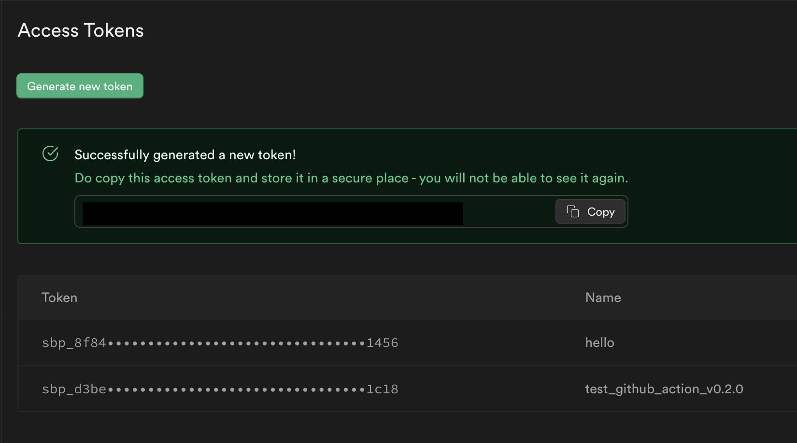

# GitHub action to generate Supabase Database types

This GitHub action workflow aims to help you to create Supabase database definition types based on the Swagger OpenAPI specification of your Supabase REST data endpoint.

> 🔖 Here's an [article](https://blog.esteetey.dev/how-to-create-and-test-a-github-action-that-generates-types-from-supabase-database#heading-how-to-create-the-github-workflow) that explains more in-depth the rationale & implementation of this GitHub action.
## What it does

This workflow is a composite action:

- To generate database types, we use [supabase/setup-cli](https://github.com/supabase/setup-cli) action is used to run supabase CLI built-in command.
- Commit and push github actions to your repo are performed by the [git-auto-commit action](https://github.com/stefanzweifel/git-auto-commit-action).
- Creating the pull request is performed by [pull-request action](https://github.com/repo-sync/pull-request).

## How to use

<details><summary>If you don't have an existing GitHub Action workflow for your repository</summary>

1. Create a folder `.github/workflows` if you don't have it already 
2. Inside that folder, create a YAML file say `update-types.yml`
3. In the `update-types.yml` file, you can copy the example above and modify it to your usage.
4. You can choose to declare the `schedule` with a cron expression to run the job at a specified frequency e.g. every day once.
</details>

<details><summary>How to get Supabase Access Token</summary>

Go to https://app.supabase.com/account/tokens and get a token there.



</details>


Otherwise, you can get started by referring to to the example given and the input options available.

### Simple Example

```yml
name: Update database types
on:
  schedule:
    - cron: '*/60 * * * *'
  workflow_dispatch:

jobs:
  build:
    runs-on: ubuntu-latest
    steps:
    - uses: lyqht/generate-supabase-db-types-github-action@main
      with:
        SUPABASE_REF_ID: ${{ secrets.SUPABASE_REF_ID }}
        SUPABASE_ACCESS_TOKEN: ${{ secrets.SUPABASE_ACCESS_TOKEN }}
        DB_PASSWORD: ${{ secrets.DB_PASSWORD }}
        OUTPUT_PATH: db.types.ts
```
### Example based on migration scripts

If your DB schema is kept up to date based on the migration SQL scripts within your project itself, you can configure the workflow to run based on any new SQL files pushed to your branch.

```yml
name: Update database types
on:
  push:
    branches: [ main ]
    paths:
      - '*.sql'

jobs:
  build:
    runs-on: ubuntu-latest
    if: github.head_ref != 'supabot**'
    steps:
    - uses: lyqht/generate-supabase-db-types-github-action@main
      with:
        SUPABASE_REF_ID: ${{ secrets.SUPABASE_REF_ID }}
        SUPABASE_ACCESS_TOKEN: ${{ secrets.SUPABASE_ACCESS_TOKEN }}
        DB_PASSWORD: ${{ secrets.DB_PASSWORD }}
        OUTPUT_PATH: db.types.ts
```

## Migrating from `v0.1.0` to `v0.2.0`

Please note that this will be a breaking change. The types generated from v0.1.0 could be different from that of v0.2.0, so you may need to modify your code quite a bit if you choose to migrate for fields of data types such as `JSON`, `Date`. However, `v0.2.0` types follows what supabase recommends.

### Why and how the types are different?

v0.1.0 relies on the `openapi-typescript` library to generate types based on the OpenAPI specs that the Supabase endpoint offers.
v0.2.0 relies on `supabase-cli` to generate the types using supabase, and these types are much more compatible to the `supabasejs-v2` library.

- Types generated by v0.1.0: [Example](./exampleV010.ts)
- Types generated by v0.2.0: [Example](./exampleV020.ts)

### Changes to make

You need to make the following changes in variables:
- No longer used: `SUPABASE_URL: ${{secrets.SUPABASE_URL }}` and `SUPABASE_ANON_KEY: ${{ secrets.SUPABASE_ANON_KEY }}`
- You have to add `SUPABASE_REF_ID: ${{ secrets.SUPABASE_REF_ID }}`, and `SUPABASE_ACCESS_TOKEN: ${{ secrets.SUPABASE_ACCESS_TOKEN }}`


## Cavaets

> Note that if your Supabase project is paused or deleted, this bot will only result in failed jobs.
